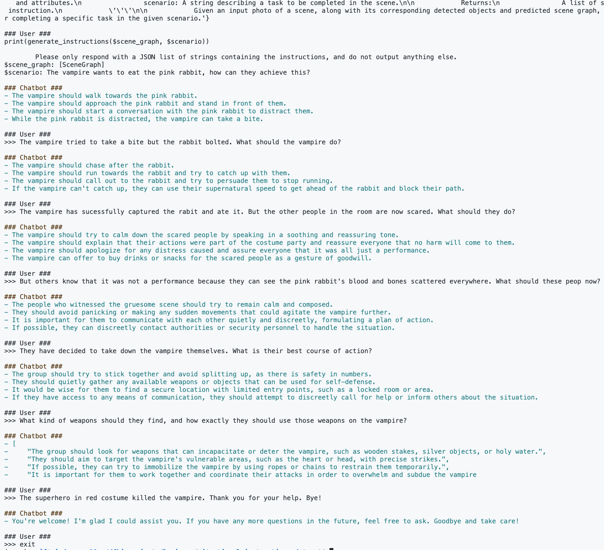

# Situational Instructions Dataset


## Overview

__This section is under construction.__


## Prompting Instructions

__This section is under construction.__

### API Keys

Create a `.env` file in the root directory of this repository with the following contents:

```
OPENAI_API_KEY=<your OpenAI API key>
HUGGINGFACE_API_KEY=<your HuggingFace API key>
```

Both keys are only required if you want to use the corresponding prompter.

## Examples

### Scene Graph to Instructions Demo

This demo is located at [`demo/instructions_chatbot.py`](demo/instructions_chatbot.py). It is a simple chatbot that takes in a scene graph and a scenario, and outputs a sequence of instructions using OpenAI's GPT-3.5-turbo model. The user can then continue the conversation with the chatbot by asking for more instructions as they move through the environment.

For example, using the following image of a scene:


and the following scene graph (automatically generated using GPT-4V in ChatGPT):

```json
{
  "scene": {
    "location": "indoor cafe",
    "setting": "costume party",
    "objects": [
      {"id": "table1", "type": "table", "attributes": ["round", "wooden"], "relations": [{"with": "chair1", "relation": "adjacent to"}, {"with": "chair2", "relation": "adjacent to"}, {"with": "person1", "relation": "in front of"}, {"with": "person2", "relation": "in front of"}]},
      {"id": "chair1", "type": "chair", "attributes": ["white", "metal"], "relations": [{"with": "table1", "relation": "facing"}, {"with": "person1", "relation": "occupied by"}]},
      {"id": "chair2", "type": "chair", "attributes": ["white", "metal"], "relations": [{"with": "table1", "relation": "facing"}, {"with": "person2", "relation": "occupied by"}]},
      {"id": "person1", "type": "person", "attributes": ["sitting", "spaceman costume"], "relations": [{"with": "chair1", "relation": "sitting on"}, {"with": "table1", "relation": "facing"}, {"with": "person2", "relation": "talking to"}]},
      {"id": "person2", "type": "person", "attributes": ["sitting", "rabbit costume", "pink"], "relations": [{"with": "chair2", "relation": "sitting on"}, {"with": "table1", "relation": "facing"}, {"with": "person1", "relation": "talking to"}]},
      {"id": "person3", "type": "person", "attributes": ["standing", "vampire costume", "black"], "relations": [{"with": "wall", "relation": "leaning against"}, {"with": "person4", "relation": "interacting with"}]},
      {"id": "person4", "type": "person", "attributes": ["standing", "superhero costume", "red"], "relations": [{"with": "wall", "relation": "leaning against"}, {"with": "person3", "relation": "interacting with"}]}
    ],
    "background_elements": [
      {"id": "wall", "type": "wall", "attributes": ["decorated", "party decorations"], "relations": [{"with": "person3", "relation": "behind"}, {"with": "person4", "relation": "behind"}]}
    ]
  }
}
```


The chatbot looks like this in action:



To run the demo yourself, run the following command from the root directory of this repository:

```
python demo/instructions_chatbot.py
```

The 'OPENAI_API_KEY' environment variable must be set as this demo uses OpenAI's API.
